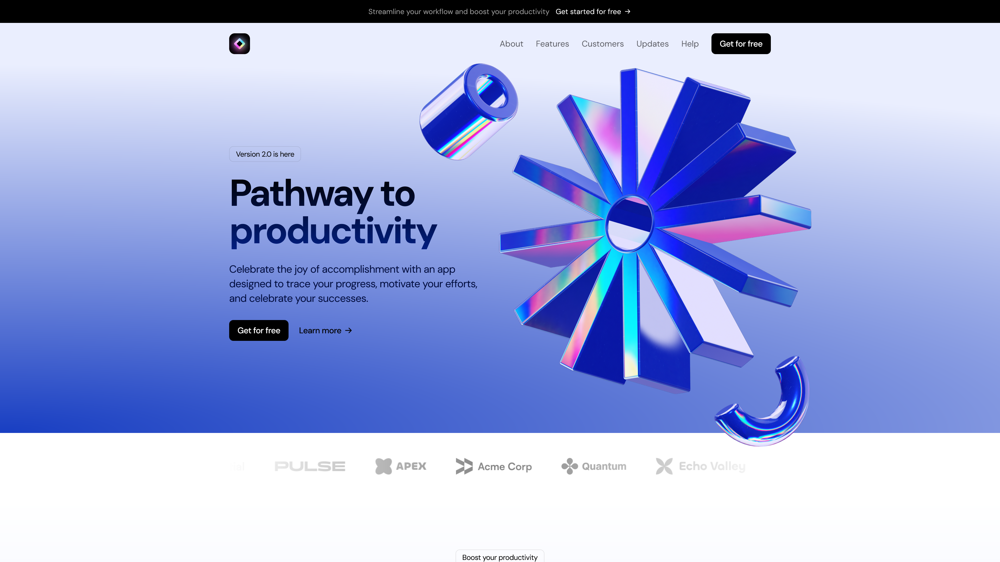

<div align="center">
  <div>
    
    
    
    
  </div>

  <a href="https://tribe-light-landing-page-dlamli.vercel.app" target="_blank">
    
  </a>
  <h3 align="center">Calendar Website</h3>

   <div align="center">
      Landing page with stunning animations, and responsive design using cutting-edge tools like React, Next.js, TailwindCSS, and Framer Motion.
    </div>
</div>

## 📋 <a name="table">Table of Contents</a>

1. ⚙️ [Tech Stack](#tech-stack)
2. 🔋 [Features](#features)
3. 🤸 [Quick Start](#quick-start)

## <a name="tech-stack">⚙️ Tech Stack</a>

- Nextjs
- Typescript
- Tailwind
- React
- Motion Frame

## <a name="features">🔋 Features</a>

👉 Master React and Next.js to build lightning-fast

👉 SEO-friendly websites

👉 Create jaw-dropping animations with Framer Motion

👉 Implement efficient styling with TailwindCSS

## <a name="quick-start">🤸 Quick Start</a>

Follow these steps to set up the project locally on your machine.

**Prerequisites**

Make sure you have the following installed on your machine:

- [Git](https://git-scm.com/)
- [Node.js](https://nodejs.org/en)
- [npm](https://www.npmjs.com/) (Node Package Manager)

**Cloning the Repository**

```bash
git clone https://github.com/dlamli/tribe-light-landing-page.git
cd tribe-light-landing-page
```

**Installation**

Install the project dependencies using npm:

```bash
npm install
```

**Running the Project**

```bash
npm run dev
```

</a>
